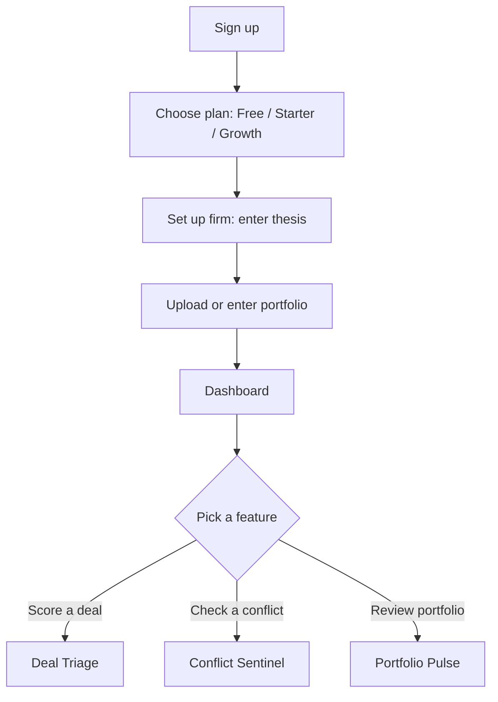
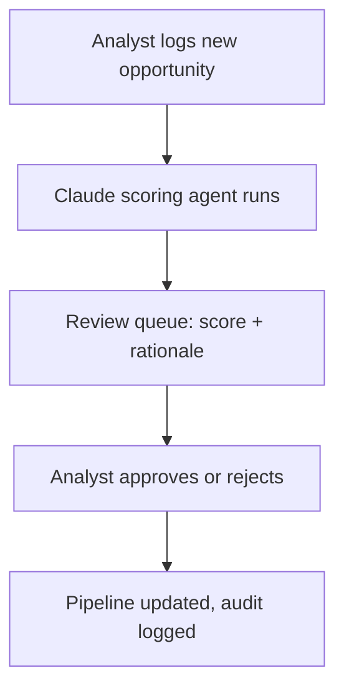
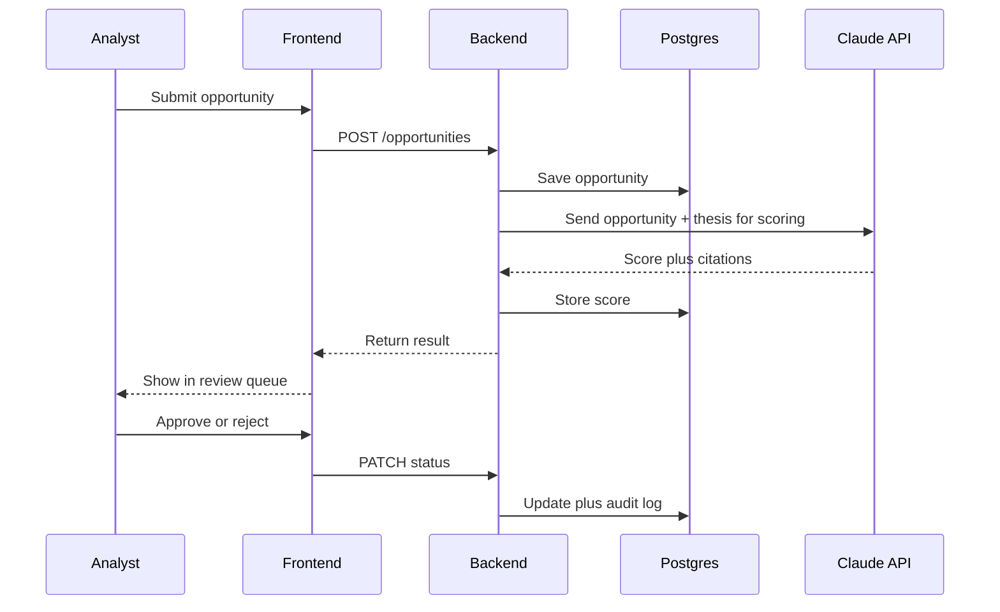
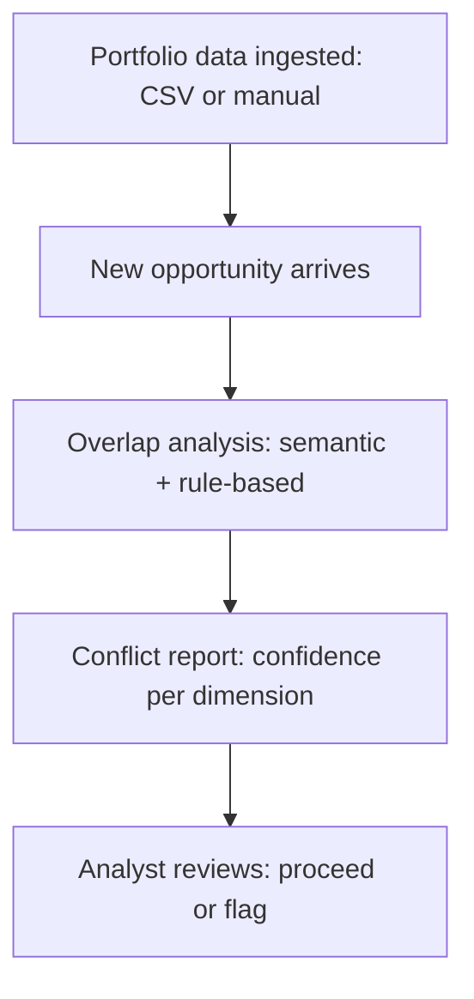
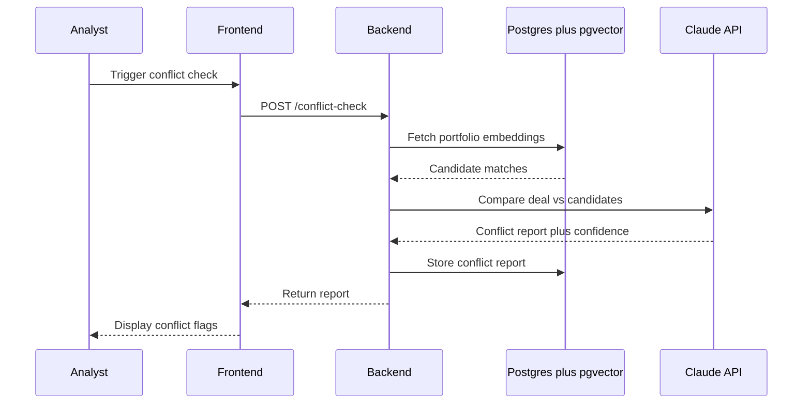
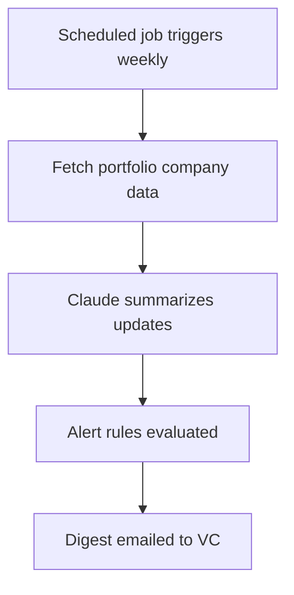
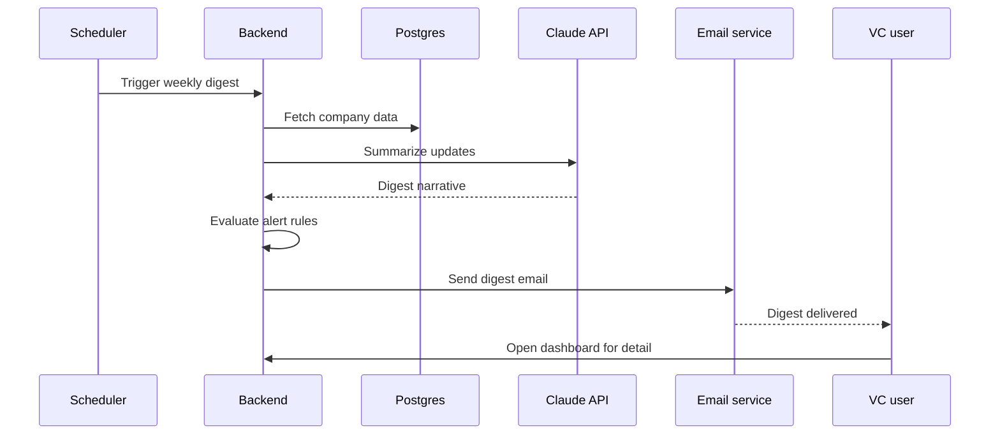
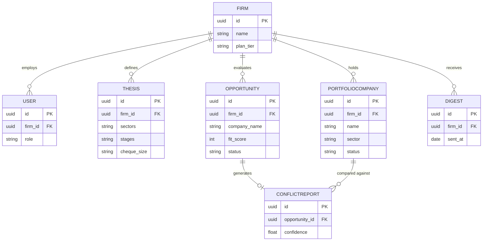

# App Flow Specification — VC Deal-Ops Platform (Narrow Build)

**Scope:** Deal Triage · Conflict Sentinel · Portfolio Pulse — VC-side only, web-first, on the existing Spring Boot monolith
**Source of scope:** Business Case v1.0 (22 July 2026), Sections 6, 7 and 10.2
**Supersedes:** the two-sided mutual-consent flow described in the April 2026 PRD v1.0 and Visual Companion — that flow is out of scope for this build

---

## 0. What this document is, and isn't

None of the five source documents (Validation Research, PRD v1.0, Visual Companion, Business Case) contain flow-level detail for this narrowed 3-feature scope. The Business Case describes *what* to build and in what order (Section 10.2) but not *how a user moves through it* screen by screen, or what each AI agent's inputs/outputs/tools are.

This document fills that gap. Everything below is newly constructed from:
- The feature descriptions in Business Case §6.1
- The build sequence and entity list in Business Case §10.2 (Foundation → Deal Triage → Conflict Sentinel → Portfolio Pulse → Billing)
- The AI Agent Specification *format* from PRD v1.0 §11 (When / Inputs / Outputs / Tools) — reused here because it is implementation-ready, not because the original agents are in scope

Anything not stated in the Business Case (exact alert thresholds, exact confidence-scoring method, etc.) is flagged as an open question in Section 8, not invented.

---

## 1. Foundation — before any feature works

Per Business Case §10.2, weeks 9–11:

- **Auth:** Self-serve sign-up. No external verification step (this build has no SEBI/SEC-style KYC — that was original-PRD scope only).
- **Roles:** Two only — **Owner**, **Member**. Not the five-role matrix (Owner/PM/Staff/Founder/Co-founder) from the original PRD.
- **Tenancy:** Every account is one Firm. Isolation enforced at the service layer.
- **Audit log:** Every write action is logged, immutable.
- **Storage:** Postgres with pgvector (for the embeddings Conflict Sentinel needs).

---

## 2. App-level flow

No such flow existed anywhere in the source documents for this scope — this is new.

Notes:
- Thesis capture (step C) and portfolio ingestion (step D) are both required setup — Deal Triage can't score without a thesis, Conflict Sentinel can't compare without a portfolio.
- The Dashboard is a single unified view (not role-specific) since there are only two roles and three features.

---

## 3. Feature: Deal Triage

### 3.1 User flow

### 3.2 Technical sequence

### 3.3 Agent spec

| | |
|---|---|
| **When** | Runs automatically on every new opportunity intake. On-demand re-score available. |
| **Inputs** | Opportunity details (company info, stage, sector, ask); firm's thesis (sectors, stages, cheque size) |
| **Outputs** | Fit score (0–100); short cited rationale; recommended action (pursue / pass / needs more info) |
| **Tools** | `thesis.match()`, `opportunity.get()`, `score.cite()` |

---

## 4. Feature: Conflict Sentinel

### 4.1 User flow

### 4.2 Technical sequence

### 4.3 Agent spec

| | |
|---|---|
| **When** | Triggered manually before a new investment decision, per Business Case §6.1 |
| **Inputs** | Candidate company details; current portfolio (ingested via CSV or manual entry — no Carta integration in this build) |
| **Outputs** | Conflict report: sector overlap, customer overlap, competitive-product overlap, each with a confidence score |
| **Tools** | `portfolio.embed()`, `portfolio.compare()`, `overlap.score()` |

**Open question (not specified anywhere in the source docs):** whether the confidence score is shown per-dimension or as one blended number. Flag for the discovery interviews.

---

## 5. Feature: Portfolio Pulse

### 5.1 User flow

### 5.2 Technical sequence

### 5.3 Agent spec

| | |
|---|---|
| **When** | Weekly scheduled job. On-demand button also available. |
| **Inputs** | Portfolio company records; latest status/metrics entered by the fund |
| **Outputs** | Markdown digest: per-company status, alerts, plain-English summary |
| **Tools** | `portfolio.get()`, `alerts.evaluate()`, `digest.compose()` |

**Open question:** exact alert-rule thresholds (e.g., what counts as "stale data" or a metric "decline") are not specified in the Business Case — needs a founder decision before this ships.

---

## 6. Data model (scoped to this build only)

This is deliberately smaller than the original PRD's data model — no `Like`, `Match`, `Message`, `PoolEntry`, `Wishlist`, or `Event` entities, because none of those concepts exist in the narrowed build.

---

## 7. Explicitly out of scope for this flow

Per Business Case §6.3, deferred until the reinstatement triggers listed there are met:

- Mutual-consent matching (the Like → Match state machine from the original PRD)
- Founder-side app entirely
- Native iOS / Android apps
- Multi-role RBAC (PM, Staff, Founder, Co-founder)
- Pool of companies / market database

If any of these get reinstated later, the flows in this document need to be re-scoped — they currently assume none of them exist.

---

## 8. Open questions (genuinely undecided, not just deferred)

1. Conflict Sentinel: per-dimension confidence display, or one blended score?
2. Portfolio Pulse: exact alert-rule thresholds for "decline" or "stale."
3. Deal Triage: does the review queue support bulk approve/reject, or one-at-a-time only?
4. None of the source documents specify what happens to an opportunity after "needs more info" — does it re-enter the queue, or wait for manual follow-up?

These need a founder decision, not more research — they weren't addressed in the discovery-interview plan either.
